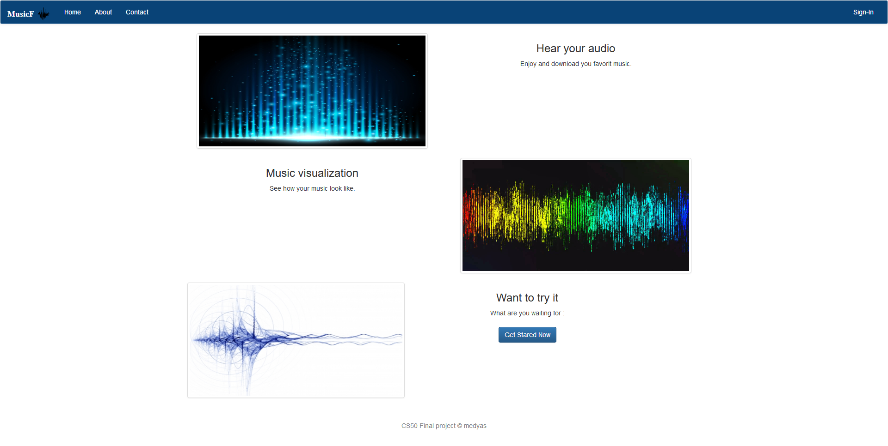
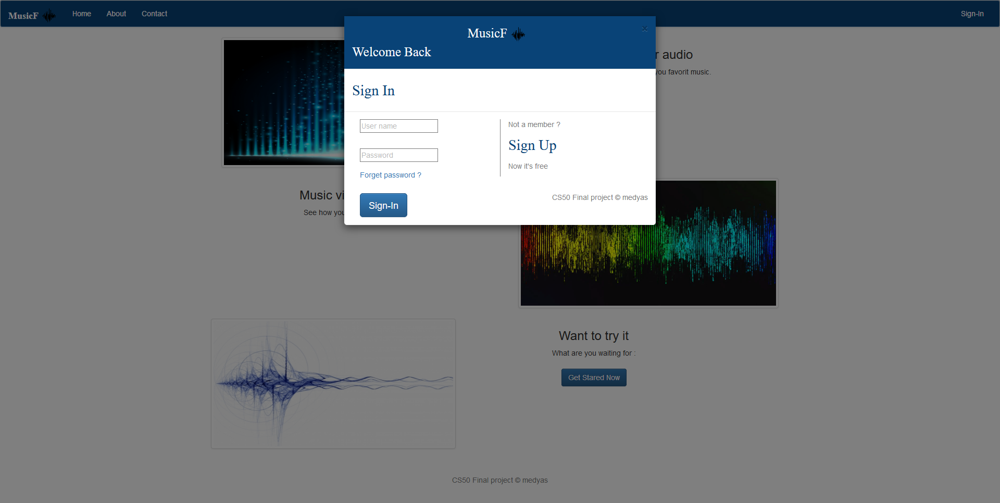
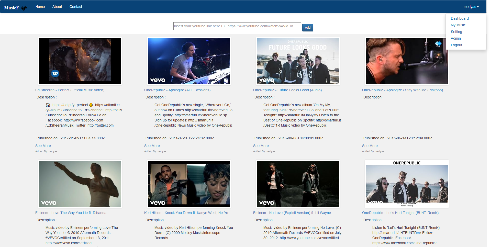
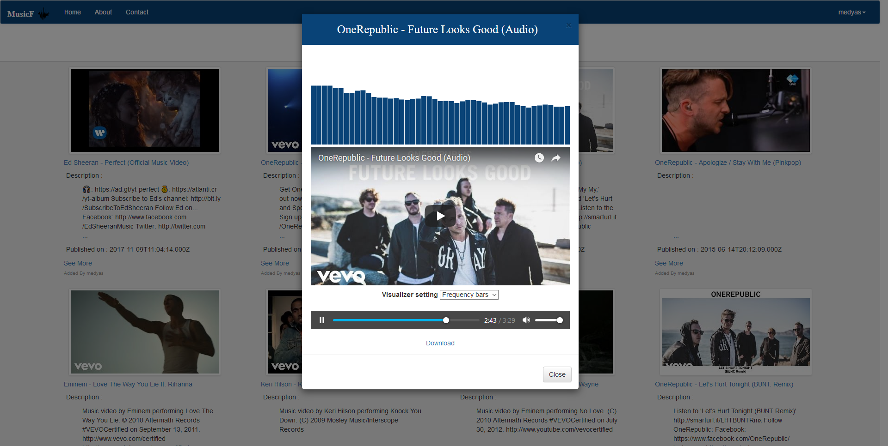

# MusicF - CS50 final Project

## OverView
This web app is my CS50 final project. Developed in 2016, and consists of visualizing the audio of youtube videos and allowing the download of mp3 files. the app has a dashboad to display a grid of all the added videos by users (after login/registration). the video can be added/removed by the owner or the admin. Users also can edit thier information.
***Used Technology***
-Python (server side - backend - using the Flask framework)
-HTML/CSS (front end)
-Javascript
-JQuery
-Bootstrap
-SQLite (for storing the data)
-YoutubeDl (for converting and getting the video mp3)

## Screenshots

